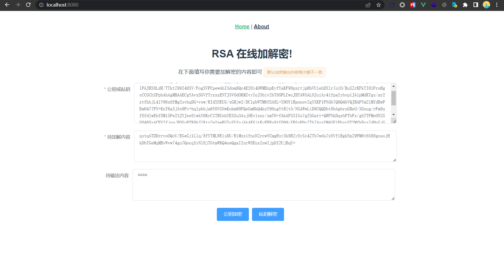

# online-encryptor
online-encryptor is for online easy use

### 目前实现的算法
RSA 在线加解密

### 使用
1. 直接使用编译好的 [online-encryptor-0.1.0.jar](https://github.com/dbgee/online-encryptor/releases/download/v0.1.0/online-encryptor-0.1.0.jar) 包
   1. `java -jar online-encryptor-0.1.0.jar`
2. 自行编译
   1. `mvn clean package`
   2. `java -jar online-encryptor-0.1.0.jar`

### 运行截图

### TODO
1. 添加更多加解密算法
2. 优化UI